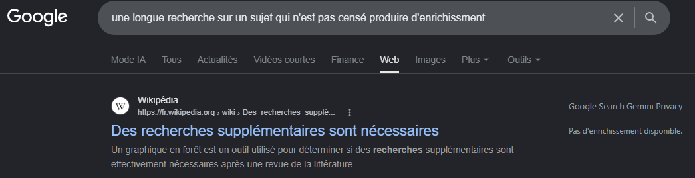

# Google Search Gemini Privacy

A Chrome extension that stops Google from sending your search queries to Gemini
for AI Overview generation — before the request ever leaves your browser. It
also restores some of the native Google features that are missing from the
plain "Web" tab (knowledge panels, movie casts) by calling open,
privacy-respecting APIs instead (OpenStreetMap, Wikipedia, TMDB).

GSGP adds "un p'tit truc en plus" to Google Search

## Why this one?

Most similar extensions **hide** the AI Overview panel after it has already
loaded — your query has already been sent to Gemini, an answer has already
been generated, and the extension just removes it from view. That's
what several popular alternatives openly describe themselves as doing:

- "Disable AI Overview": *"a lightweight browser extension that
  **automatically hides** the AI Overview section"* ([Chrome Web Store](https://chromewebstore.google.com/detail/disable-ai-overview-turn/jledohjahnkncbmnfmbnaophlakhoanl))
- "Hide AI — Remove AI Overview from Google": *"automatically **hides**
  supported AI Overview and AI result blocks **when they appear**"*
  ([Chrome Web Store](https://chromewebstore.google.com/detail/hide-ai-remove-ai-overvie/hnmjjbiimioedlmbmagkoilanplikoep))
- "Google AI Overviews Blocker": *"enhances user experience by **hiding**
  AI-generated overviews"* ([GitHub](https://github.com/zbarnz/Google_AI_Overviews_Blocker))
- "Block AI Overview" comes closer — it does attempt to block the request via
  `chrome.tabs.onUpdated`, rewriting the URL to add `udm=14`. In practice
  this still runs *after* Chrome has already started the navigation: the
  first request (without `udm=14`) goes out, then a second navigation
  corrects the tab, causing a brief flash of the AI Overview before it's
  replaced. So the request isn't actually prevented in that case, even
  though blocking it is clearly the intent.

"When they appear" is the key phrase — the request to Gemini already happened.
If your concern is the query not being sent at all, for Google not logging your requests more than it should do, this extension is the right tool.

Technicalities :

It adds `udm=14` to the search request itself, at the
network level. Google serves the plain "Web" results tab directly, and no AI Overview is ever generated.

Worth noting: `udm=14` isn't a secret or a hack specific to this extension, it's the same parameter Google's own "Web" tab (under the search page's "More" menu) uses. Several outlets have written about it as a manual workaround
([TechRadar](https://www.techradar.com/pro/this-free-chrome-extension-makes-google-way-better-and-faster-by-getting-rid-of-ai-overviews-and-much-more),
[Tom's Guide](https://www.tomsguide.com/ai/how-to-block-google-ai-overviews-from-appearing-in-your-search-results)).
This extension just applies it automatically and consistently, instead of
requiring a manual click on every search.

## How it works

- A static [`declarativeNetRequest`](https://developer.chrome.com/docs/extensions/reference/api/declarativeNetRequest)
  rule redirects any Google search request without a `udm` parameter to the
  same URL with `udm=14` added — before the request reaches the network.
- Search requests that already specify a different mode (Images, Videos, AI
  Mode, etc.) are left untouched.
- Toggling the extension off only affects *future* searches. It doesn't
  touch tabs you already have open — a tab that already loaded a result
  stays as it is.

## Knowledge panels

Blocking the AI Overview also removes the small "About" cards Google used to
show for places, and the cast/filmography info for movies and actors. This
extension rebuilds those in a side panel, sourced from open APIs instead of
an AI model:

- **Places** — summary, image, and an embedded map, from OpenStreetMap
  (Nominatim) and Wikipedia.
- **Movies & people** — cast, director, and filmography, from TMDB (The
  Movie Database).

Small/obscure places (hamlets, homonyms) are filtered out by default, since
those are usually better served by an actual maps search.

Domains contacted for this feature: `nominatim.openstreetmap.org`,
`*.wikipedia.org`, `www.wikidata.org`, `api.themoviedb.org`,
`image.tmdb.org`. None of these calls go through Gemini or any AI model.
A TMDB API token (free) is required for the movie/people panel — see the
extension's settings.

## Install

### Chrome-only: unpacked

This extension isn't published on the Chrome Web Store.

1. Download or clone this repository.
2. Open `chrome://extensions` in Chrome.
3. Enable **Developer mode** (top right).
4. Click **Load unpacked** and select the folder.
5. The extension icon appears in your toolbar — click it to toggle
   protection on or off.

> Note: Chrome may show a warning about `background.scripts` in the
> manifest. This is expected — the manifest is kept cross-browser, and
> that key is there for Firefox (which doesn't support MV3 service
> workers). Chrome ignores it and uses `background.service_worker`
> instead.
   
### Firefox: signed package

This gurantees the manifest has been audited by Mozilla before you install it.

1. Go to the Releases page on this repo
2. download the .xpi file on your drive
3. type "about:addons" in the url field
4. click on the gear icon, select "install addon from file" and select the .xpi you downloaded

> Nota : This .xpi passed Mozilla's automated validation for unlisted add-ons and Mozilla's signature confirms the file hasn't been altered since signing. It isn't guaranteed a human code review before signing. If you'd rather verify the code yourself, the .xpi is a zip archive containing the exact same source as this repository at the tagged release; you can unzip it and diff the files against the repo.

## Limitations

- Only covers Google Search's own results page. It doesn't affect other
  Google surfaces (e.g. the separate "AI Mode" tab, which you can still
  select manually — this extension only stops it from being the *default*).
- Knowledge panels are best-effort: they rely on the query matching an
  entry in OpenStreetMap/Wikipedia/TMDB, so not every search will show one
  — Google's own panels have access to more (and licensed) data.

## License

MIT